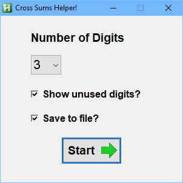
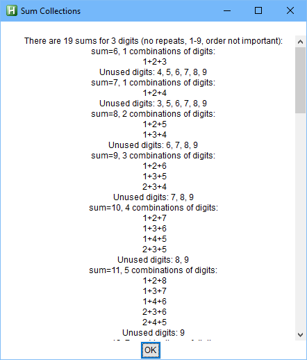
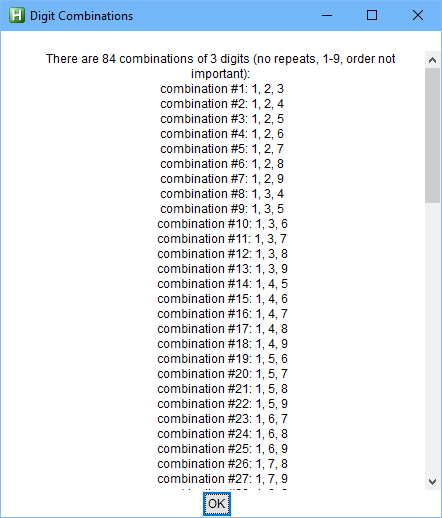

# Cross-Sums
AutoHotkey project to calculate all the combinations of numeric options for the crossword style summing game.

Number combinations must be: 
* integers 1-9 (no zeros)
* non-repeating
* more than one digit (less than 9)

# Background
I bought my first copy of a Dell Solver's Choice Variety Puzzle while boarding a flight. I've been addicted ever since and this particular game has really go my programming brain tingling.  I'm sure there are other, more efficient solutions.  But this one is mine.

# References

Penny Dell Puzzles [cross sums web page](https://www.pennydellpuzzles.com/?s=cross+sums)

# Application 

# File Export 

File export option prints a nice cheat sheet similar to the one PennyPress publishes [on their website](https://www.pennydellpuzzles.com/wp-content/uploads/2019/01/sum-sample-page.pdf)

Sample output (with unused digits option enabled):

	6 = 1+2+3; 	(4, 5, 6, 7, 8, 9)
	7 = 1+2+4; 	(3, 5, 6, 7, 8, 9)
	8 = 1+2+5; 	1+3+4; 	(6, 7, 8, 9)
	9 = 1+2+6; 	1+3+5; 	2+3+4; 	(7, 8, 9)
	10 = 1+2+7; 	1+3+6; 	1+4+5; 	2+3+5; 	(8, 9)
	11 = 1+2+8; 	1+3+7; 	1+4+6; 	2+3+6; 	2+4+5; 	(9)
	12 = 1+2+9; 	1+3+8; 	1+4+7; 	1+5+6; 	2+3+7; 	2+4+6; 	3+4+5; 	
	13 = 1+3+9; 	1+4+8; 	1+5+7; 	2+3+8; 	2+4+7; 	2+5+6; 	3+4+6; 	
	14 = 1+4+9; 	1+5+8; 	1+6+7; 	2+3+9; 	2+4+8; 	2+5+7; 	3+4+7; 	3+5+6; 	
	15 = 1+5+9; 	1+6+8; 	2+4+9; 	2+5+8; 	2+6+7; 	3+4+8; 	3+5+7; 	4+5+6; 	
	16 = 1+6+9; 	1+7+8; 	2+5+9; 	2+6+8; 	3+4+9; 	3+5+8; 	3+6+7; 	4+5+7; 	
	17 = 1+7+9; 	2+6+9; 	2+7+8; 	3+5+9; 	3+6+8; 	4+5+8; 	4+6+7; 	
	18 = 1+8+9; 	2+7+9; 	3+6+9; 	3+7+8; 	4+5+9; 	4+6+8; 	5+6+7; 	
	19 = 2+8+9; 	3+7+9; 	4+6+9; 	4+7+8; 	5+6+8; 	(1)
	20 = 3+8+9; 	4+7+9; 	5+6+9; 	5+7+8; 	(1, 2)
	21 = 4+8+9; 	5+7+9; 	6+7+8; 	(1, 2, 3)
	22 = 5+8+9; 	6+7+9; 	(1, 2, 3, 4)
	23 = 6+8+9; 	(1, 2, 3, 4, 5, 7)
	24 = 7+8+9; 	(1, 2, 3, 4, 5, 6)
